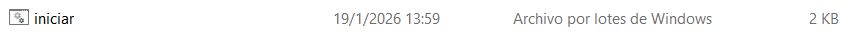
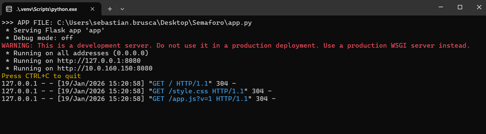
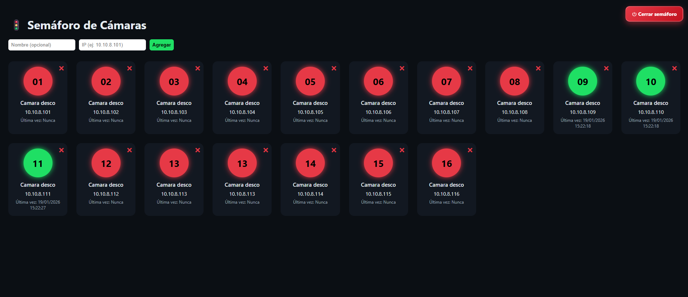

# 🚦 Semáforo de Cámaras

Sistema visual de monitoreo para verificar el estado de cámaras de desconsolidado en red.

Este semáforo permite saber **rápidamente si una cámara está encendida o apagada**, evitando errores operativos cuando una cámara deja de responder o recién se enciende.

---

## 🧠 ¿Qué es este proyecto?

El **Semáforo de Cámaras** es una aplicación desarrollada en Python que controla el estado de cámaras IP mediante verificación de red (ping) y muestra su estado en una interfaz web clara e intuitiva.

Su objetivo principal es **evitar errores operativos**, permitiendo saber de forma inmediata si una cámara está funcionando o no.

---

## ⚙️ Funcionalidades

- Verificación automática de conectividad de cámaras IP
- Indicador visual tipo semáforo:
  - 🟢 Verde: cámara encendida / responde
  - 🔴 Rojo: cámara apagada / sin respuesta
- Registro de la última vez que la cámara respondió
- Agregar y eliminar cámaras desde la interfaz
- Botón de **Cerrar semáforo** para finalizar correctamente todos los procesos
- Interfaz web simple y clara

---

## ▶️ Cómo iniciar el semáforo

Ejecutar el archivo:

📌 **Importante**  
La primera vez que se ejecuta:

- Se instalarán automáticamente las dependencias necesarias
- Se abrirá una **ventana de consola (CMD)** que quedará minimizada
- **NO debe cerrarse esa ventana**, ya que si se cierra:
  
❌ El semáforo dejará de funcionar

---

## 🖥️ Archivo de inicio

Este es el archivo que debe ejecutarse para iniciar el sistema:

---

## ⚠️ Consola en segundo plano (NO cerrar)

Esta ventana ejecuta el servidor del semáforo.

- Puede quedar minimizada
- No debe cerrarse manualmente
- El botón “Cerrar semáforo” se encarga de detener todo correctamente

---

## 🚦 Interfaz del semáforo

Desde la interfaz se puede:

- Visualizar el estado de todas las cámaras
- Agregar nuevas cámaras por IP
- Eliminar cámaras existentes
- Cerrar correctamente el sistema

---

## 🐍 Requisito obligatorio: Python

Este sistema **requiere Python instalado en la PC**.

Descargar desde:

https://www.python.org/downloads/windows/

Durante la instalación es obligatorio marcar:

✔️ `Add Python to PATH`

---

## 🛠️ Tecnologías utilizadas

- Python 3
- Flask
- HTML
- CSS
- JavaScript

---

## 📌 Uso recomendado

Ideal para entornos donde se necesita:

- Monitorear cámaras de red
- Detectar fallas rápidamente
- Evitar errores por cámaras apagadas
- Visualización simple y efectiva del estado de red

---

## 👤 Autor

Desarrollado por **Sebastian Brusca**  
Proyecto de monitoreo de infraestructura interna

---

---

# 🚦 Camera Traffic Light (English)

Visual monitoring system to check the operational status of network IP cameras.

This application allows you to **quickly identify whether a camera is online or offline**, helping prevent operational errors when a camera stops responding or has just powered on.

---

## 🧠 What is this project?

**Camera Traffic Light** is a Python-based application that monitors IP cameras using network checks (ping) and displays their status through a clean and intuitive web interface.

Its main goal is to **prevent operational errors** by providing immediate visibility of camera availability.

---

## ⚙️ Features

- Automatic IP camera connectivity checks
- Traffic light visual indicator:
  - 🟢 Green: camera online / responding
  - 🔴 Red: camera offline / not responding
- Last response timestamp
- Add and remove cameras from the interface
- **Close traffic light** button to safely stop all background processes
- Simple and user-friendly web interface

---

## ▶️ How to start

Run the following file:

📌 **Important**  
On the first run:

- Required dependencies will be installed automatically
- A **command prompt window** will open and remain minimized
- **Do NOT close this window**, otherwise:

❌ The traffic light system will stop working

---

## 🖥️ Start file

This is the file that must be executed to start the system:

---

## ⚠️ Background console (Do NOT close)

This console runs the traffic light server.

- It can remain minimized
- Must not be closed manually
- Use the “Close traffic light” button to stop everything safely

---

## 🚦 Traffic light interface

From the interface you can:

- View camera status
- Add cameras by IP
- Remove cameras
- Safely shut down the system

---

## 🐍 Mandatory requirement: Python

This system **requires Python to be installed**.

Download from:

https://www.python.org/downloads/windows/

During installation make sure to check:

✔️ `Add Python to PATH`

---

## 🛠️ Technologies used

- Python 3
- Flask
- HTML
- CSS
- JavaScript

---

## 👤 Author

Developed by **Sebastian Brusca**  
Internal infrastructure monitoring project

